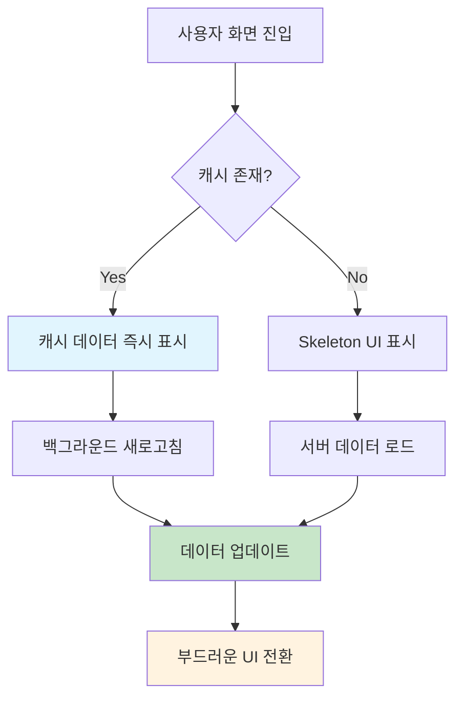

# LME 시세 프론트엔드 연동 아키텍처

> **📋 문서 정보**  
> 작성일: 2025-01-30  
> 작성자: Winston (Solution Architect)  
> 목적: Supabase + TanStack Query 기반 LME 시세 실시간 연동 시스템 설계

---

## 🏗️ 시스템 개요

### 아키텍처 목표

- **사용자 경험 우선**: 빠른 로딩, 매끄러운 인터랙션
- **데이터 중심 설계**: 실시간 시세 데이터의 안정적 제공
- **점진적 복잡성**: 간단한 시작, 확장 가능한 구조
- **오프라인 복원력**: 네트워크 불안정 상황 대응

### 현재 상태 분석

**✅ 완료된 백엔드 인프라:**

- Supabase Edge Functions LME 크롤러 시스템
- `lme_processed_prices` 테이블 (6개 금속: 구리, 알루미늄, 아연, 납, 니켈, 주석)
- 원/KG 단위 변환 저장, 일별 변화율 계산
- RLS 보안 정책 설정 완료

**🔄 전환 필요 사항:**

- 정적 데이터 (`collected-metal-prices.ts`) → 실시간 API 연동
- 하드코딩된 가격 → 동적 Supabase 데이터
- TanStack Query 패턴 확장

---

## 📊 데이터 아키텍처

### 데이터베이스 스키마 활용

```sql
-- 메인 시세 데이터 테이블
lme_processed_prices {
  id: UUID PRIMARY KEY
  metal_code: VARCHAR(10)        -- 'copper', 'aluminum', etc.
  metal_name_kr: VARCHAR(20)     -- '구리', '알루미늄', etc.
  price_krw_per_kg: DECIMAL(12,2) -- 원/KG (메인 표시 가격)
  price_usd_per_ton: DECIMAL(12,4) -- USD/톤 (원본 가격)
  change_percent: DECIMAL(8,4)   -- 전일 대비 변화율
  change_type: VARCHAR(10)       -- 'positive', 'negative', 'unchanged'
  change_amount_krw: DECIMAL(12,2) -- 원화 기준 변화량
  exchange_rate: DECIMAL(10,4)   -- 적용된 USD/KRW 환율
  price_date: DATE               -- 가격 기준일
  processed_at: TIMESTAMPTZ      -- 처리 시간

  UNIQUE(metal_code, price_date) -- 일별 유니크 제약
}
```

### 성능 최적화 인덱스

```sql
-- 메인 화면용: 최신 가격 조회
CREATE INDEX idx_lme_processed_prices_metal_date
ON lme_processed_prices(metal_code, price_date DESC);

-- 상세 화면용: 시간순 정렬
CREATE INDEX idx_lme_processed_prices_processed_at
ON lme_processed_prices(processed_at DESC);

-- 변화율 필터링용
CREATE INDEX idx_lme_processed_prices_change_type
ON lme_processed_prices(change_type, price_date DESC);
```

---

## 🔗 API 레이어 설계

### 쿼리 키 패턴

```typescript
export const lmeKeys = {
  all: ["lme"] as const,
  latest: () => [...lmeKeys.all, "latest"] as const,
  history: () => [...lmeKeys.all, "history"] as const,
  metal: (metalCode: string) => [...lmeKeys.all, "metal", metalCode] as const,
  metalHistory: (metalCode: string, days: number) =>
    [...lmeKeys.metal(metalCode), "history", days] as const,
  status: () => [...lmeKeys.all, "status"] as const,
};
```

### 주요 API 엔드포인트

#### 1. 최신 시세 조회 (메인 화면용)

```typescript
// Function: get_latest_lme_prices()
// Purpose: 각 금속별 최신 가격 데이터 조회
// Cache: 2분, Background refresh

interface LatestLmePrice {
  metal_code: string;
  metal_name_kr: string;
  price_krw_per_kg: number;
  change_percent: number;
  change_type: 'positive' | 'negative' | 'unchanged';
  price_date: string;
  last_updated: string;
}

// SQL Query:
SELECT DISTINCT ON (metal_code)
  metal_code, metal_name_kr, price_krw_per_kg,
  change_percent, change_type, price_date,
  processed_at as last_updated
FROM lme_processed_prices
WHERE price_date >= CURRENT_DATE - INTERVAL '3 days'
ORDER BY metal_code, price_date DESC, processed_at DESC;
```

#### 2. 금속별 히스토리 조회 (상세 화면용)

```typescript
// Purpose: 특정 금속의 30일 가격 히스토리
// Cache: 5분, Prefetch on hover

interface MetalHistoryData {
  metal_code: string;
  price_date: string;
  price_krw_per_kg: number;
  price_usd_per_ton: number;
  change_percent: number;
  change_type: 'positive' | 'negative' | 'unchanged';
  exchange_rate: number;
}

// SQL Query:
SELECT metal_code, price_date, price_krw_per_kg,
       price_usd_per_ton, change_percent, change_type, exchange_rate
FROM lme_processed_prices
WHERE metal_code = $1
  AND price_date >= CURRENT_DATE - INTERVAL '30 days'
ORDER BY price_date DESC;
```

#### 3. 크롤링 상태 확인

```typescript
// Function: get_crawling_status()
// Purpose: 시스템 상태 및 데이터 신뢰성 확인

interface CrawlingStatus {
  last_success_at: string;
  last_failure_at: string | null;
  is_currently_running: boolean;
  success_rate_24h: number;
  avg_duration_ms: number;
}
```

---

## ⚡ 성능 최적화 전략

### 캐시 레이어 구조

```yaml
L1_Memory_Cache:
  duration: 2분
  scope: 최신 가격 데이터 (6개 금속)
  strategy: 즉시 표시용
  size_limit: ~50KB

L2_Persistent_Cache:
  duration: 15분
  scope: 상세 히스토리 데이터
  strategy: 백그라운드 프리페칭
  size_limit: ~2MB

L3_Background_Cache:
  duration: 1시간
  scope: 메타데이터, 설정값
  strategy: 앱 시작 시 로드
  size_limit: ~100KB
```

### 데이터 로딩 패턴



### Progressive Loading 전략

1. **Level 1**: Skeleton UI (즉시)
2. **Level 2**: 캐시된 데이터 (100ms 이내)
3. **Level 3**: 서버 최신 데이터 (500ms 이내)
4. **Level 4**: 차트 애니메이션 (1초 이내)

---

## 🏛️ 컴포넌트 아키텍처

### Hook 기반 데이터 관리

```typescript
// hooks/useLmePrices.ts
export const useLatestLmePrices = () => {
  return useQuery({
    queryKey: lmeKeys.latest(),
    queryFn: () => supabase.rpc("get_latest_lme_prices"),
    staleTime: 2 * 60 * 1000, // 2분
    gcTime: 10 * 60 * 1000, // 10분
    refetchOnWindowFocus: true,
    refetchOnReconnect: true,
  });
};

export const useMetalHistory = (metalCode: string, days = 30) => {
  return useQuery({
    queryKey: lmeKeys.metalHistory(metalCode, days),
    queryFn: () => fetchMetalHistory(metalCode, days),
    staleTime: 5 * 60 * 1000, // 5분
    enabled: !!metalCode,
  });
};

export const useCrawlingStatus = () => {
  return useQuery({
    queryKey: lmeKeys.status(),
    queryFn: () => supabase.rpc("get_crawling_status"),
    staleTime: 30 * 1000, // 30초
    refetchInterval: 60 * 1000, // 1분마다 폴링
  });
};
```

### 컴포넌트 레이어 분리

```
📱 Screen Components (앱 화면)
├── 🏠 MetalPriceListScreen
├── 🔍 MetalDetailScreen
└── ⚙️ SettingsScreen

🧩 Feature Components (기능별)
├── 💰 MetalPriceCard
├── 📊 PriceChart
├── 📈 TrendIndicator
└── 🔄 RefreshButton

🎨 UI Components (재사용)
├── 💀 SkeletonLoader
├── ⚠️ ErrorBoundary
├── 📡 ConnectivityBanner
└── 🎭 LoadingSpinner
```

---

## 🛡️ 에러 처리 & 복원력

### 다층 에러 처리 전략

```typescript
// 1. Network Layer - 재시도 로직
const queryClient = new QueryClient({
  defaultOptions: {
    queries: {
      retry: (failureCount, error) => {
        if (error.status === 404) return false;
        return failureCount < 3;
      },
      retryDelay: (attemptIndex) => Math.min(1000 * 2 ** attemptIndex, 30000),
    },
  },
});

// 2. Cache Layer - Stale While Revalidate
const useLatestLmePricesWithFallback = () => {
  return useQuery({
    queryKey: lmeKeys.latest(),
    queryFn: fetchLatestPrices,
    staleTime: 2 * 60 * 1000,
    gcTime: 24 * 60 * 60 * 1000, // 24시간 보관
    placeholderData: keepPreviousData, // 이전 데이터 유지
  });
};

// 3. UI Layer - 에러 바운더리
export const PriceDataErrorBoundary = ({ children }) => {
  return (
    <ErrorBoundary
      fallback={<OfflineDataView />}
      onError={(error) => {
        logError("LME_PRICE_ERROR", error);
        showToast("네트워크 연결을 확인해주세요");
      }}
    >
      {children}
    </ErrorBoundary>
  );
};
```

### 오프라인 지원 전략

```typescript
// 네트워크 상태 감지
const useNetworkStatus = () => {
  const [isOnline, setIsOnline] = useState(true);

  useEffect(() => {
    const unsubscribe = NetInfo.addEventListener((state) => {
      setIsOnline(state.isConnected);
    });
    return unsubscribe;
  }, []);

  return isOnline;
};

// 오프라인 UI 표시
const ConnectivityBanner = () => {
  const isOnline = useNetworkStatus();

  if (isOnline) return null;

  return (
    <View className="bg-amber-500 p-2">
      <Text className="text-center text-white text-sm">
        📡 오프라인 모드 - 마지막 업데이트 데이터를 표시합니다
      </Text>
    </View>
  );
};
```

---

## 🚀 구현 로드맵

### Phase 1: 기반 구조 (1일)

```bash
# 1.1 Supabase 타입 생성
npx supabase gen types typescript --project-id [PROJECT_ID] > types/supabase.ts

# 1.2 LME Query Hooks 생성
mkdir hooks/lme
touch hooks/lme/useLmePrices.ts
touch hooks/lme/useMetalHistory.ts
touch hooks/lme/useCrawlingStatus.ts

# 1.3 타입 정의
touch types/lme.ts
```

**핵심 작업:**

- [ ] Supabase 타입 정의 자동 생성
- [ ] LME 관련 Hook 구조 설계
- [ ] 기본 쿼리 키 패턴 정의
- [ ] 에러 처리 유틸리티 함수

### Phase 2: 시세 화면 연동 (1일)

**핵심 작업:**

- [ ] `collected-metal-prices.ts` 파일 대체
- [ ] `useLatestLmePrices` Hook 구현
- [ ] 메인 시세 화면 실시간 데이터 바인딩
- [ ] 로딩/에러 상태 UI 처리
- [ ] 백그라운드 새로고침 구현

### Phase 3: 상세 화면 고도화 (1일)

**핵심 작업:**

- [ ] `useMetalHistory` Hook 구현
- [ ] 30일 차트 데이터 연동
- [ ] Progressive Loading UI 구현
- [ ] 차트 애니메이션 최적화
- [ ] 프리페칭 전략 적용

### Phase 4: 폴리싱 & 최적화 (0.5일)

**핵심 작업:**

- [ ] 에러 시나리오 테스트
- [ ] 오프라인 모드 검증
- [ ] 성능 메트릭 측정
- [ ] UX 개선사항 적용
- [ ] 문서화 업데이트

---

## 📈 성능 모니터링

### 핵심 메트릭

```typescript
interface PerformanceMetrics {
  // 로딩 성능
  firstContentfulPaint: number; // 첫 화면 표시 시간
  timeToInteractive: number; // 인터랙션 가능 시간

  // API 성능
  apiResponseTime: number; // 평균 응답 시간
  cacheHitRate: number; // 캐시 적중률

  // 사용자 경험
  errorRate: number; // 에러 발생률
  offlineUsageRate: number; // 오프라인 사용 비율

  // 비즈니스 메트릭
  priceDataFreshness: number; // 데이터 신선도 (분)
  userEngagementTime: number; // 평균 사용 시간
}
```

### 성능 임계값

- **첫 화면 표시**: < 200ms (캐시 적중 시)
- **API 응답 시간**: < 500ms (95 percentile)
- **캐시 적중률**: > 80%
- **에러 발생률**: < 1%
- **데이터 신선도**: < 5분

---

## 🔐 보안 고려사항

### RLS 정책 활용

```sql
-- 읽기 전용 정책 (모든 사용자)
CREATE POLICY "public_read_lme_prices"
ON lme_processed_prices FOR SELECT
TO public
USING (true);

-- 수정은 서비스 롤만 가능
CREATE POLICY "service_role_write_lme_prices"
ON lme_processed_prices FOR ALL
TO service_role
USING (true);
```

### 데이터 검증

```typescript
// 클라이언트 측 데이터 유효성 검증
const validatePriceData = (data: any): data is LatestLmePrice => {
  return (
    typeof data.metal_code === "string" &&
    typeof data.price_krw_per_kg === "number" &&
    data.price_krw_per_kg > 0 &&
    ["positive", "negative", "unchanged"].includes(data.change_type)
  );
};
```

---

## 📝 마이그레이션 체크리스트

### 기존 코드 정리

- [ ] `data/dashboard/collected-metal-prices.ts` 파일 분석
- [ ] 하드코딩된 가격 데이터 식별
- [ ] 기존 컴포넌트의 props interface 확인
- [ ] 계산기 화면의 금속 가격 연동 방안 검토

### API 전환 작업

- [ ] 정적 데이터 → 동적 API 호출 변경
- [ ] 에러 처리 로직 추가
- [ ] 로딩 상태 UI 구현
- [ ] 캐시 무효화 전략 적용

### 품질 보증

- [ ] 단위 테스트 작성
- [ ] 통합 테스트 작성
- [ ] 성능 테스트 실행
- [ ] 사용자 수용 테스트

---

## 🎯 결론

이 아키텍처는 다음 핵심 가치를 실현합니다:

1. **사용자 중심**: 빠른 로딩과 매끄러운 경험
2. **데이터 신뢰성**: 실시간 업데이트와 오프라인 복원력
3. **개발자 친화적**: 타입 안전성과 유지보수성
4. **확장 가능성**: 추가 금속이나 기능 확장 용이

기존의 완성된 LME 크롤러 시스템과 시너지를 만들어 **안정적이고 확장 가능한 시세 서비스**를 구축할 수 있습니다.

---

**📞 Contact & Support**

- 아키텍트: Winston
- 문서 버전: v1.0
- 최종 업데이트: 2025-01-30
