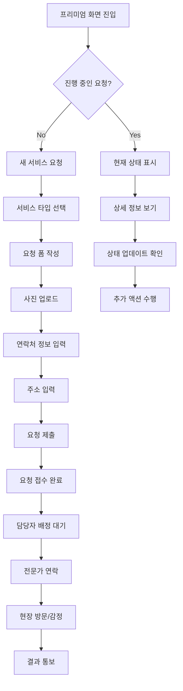

# 프리미엄 서비스 요청 시스템 아키텍처

> **📋 문서 정보**  
> 작성일: 2025-01-30  
> 작성자: Winston (Solution Architect)  
> 목적: Supabase + TanStack Query 기반 프리미엄 서비스 요청 관리 시스템 설계

---

## 🏗️ 시스템 개요

### 아키텍처 목표

- **사용자 경험 우선**: 직관적인 서비스 요청 플로우
- **상태 중심 설계**: 요청부터 완료까지 전 과정 추적
- **확장 가능한 구조**: 다양한 서비스 타입 대응
- **실시간 상태 업데이트**: 요청 진행 상황 즉시 반영

### 현재 상태 분석

**✅ 완료된 기반 인프라:**

- Supabase 데이터베이스 및 인증 시스템
- TanStack Query 상태 관리 패턴
- 프리미엄 화면 UI (정적)
- 서비스 요청 폼 UI (로컬 상태만)

**🔄 구현 필요 사항:**

- 서비스 요청 데이터 모델 및 스키마
- 상태 관리 및 실시간 업데이트
- 사진 업로드 시스템
- 요청 이력 및 상세 화면

**🎯 핵심 서비스:**

- **현장 방문 감정**: 전문가 직접 방문을 통한 정밀 감정
- **즉시 매입 서비스**: 감정 완료 후 현금 즉시 매입

---

## 📊 데이터 아키텍처

### 데이터베이스 스키마

```sql
-- 서비스 요청 메인 테이블
CREATE TABLE service_requests (
  id UUID PRIMARY KEY DEFAULT gen_random_uuid(),
  user_id UUID REFERENCES auth.users(id), -- 향후 인증 시스템 연동
  service_type TEXT NOT NULL CHECK (service_type IN ('appraisal', 'purchase')),
  status TEXT NOT NULL DEFAULT 'pending'
    CHECK (status IN ('pending', 'assigned', 'in_progress', 'completed', 'cancelled')),

  -- 연락처 정보
  contact_phone TEXT NOT NULL,
  address TEXT NOT NULL,
  address_detail TEXT,
  description TEXT NOT NULL,

  -- 일정 및 처리 정보
  scheduled_date TIMESTAMPTZ,
  assigned_expert_id UUID,
  expert_notes TEXT,
  estimated_value NUMERIC(15,2),
  final_offer NUMERIC(15,2),

  -- 메타데이터
  created_at TIMESTAMPTZ DEFAULT NOW(),
  updated_at TIMESTAMPTZ DEFAULT NOW(),
  completed_at TIMESTAMPTZ,

  -- 인덱스
  INDEX idx_service_requests_user_id (user_id),
  INDEX idx_service_requests_status (status),
  INDEX idx_service_requests_created_at (created_at)
);

-- 서비스 요청 사진 테이블
CREATE TABLE service_request_photos (
  id UUID PRIMARY KEY DEFAULT gen_random_uuid(),
  service_request_id UUID NOT NULL REFERENCES service_requests(id) ON DELETE CASCADE,
  photo_url TEXT NOT NULL,
  photo_order INTEGER NOT NULL DEFAULT 0,
  is_representative BOOLEAN DEFAULT FALSE,
  created_at TIMESTAMPTZ DEFAULT NOW(),

  -- 인덱스
  INDEX idx_service_request_photos_request_id (service_request_id),
  INDEX idx_service_request_photos_order (service_request_id, photo_order)
);

-- 상태 변경 로그 테이블
CREATE TABLE service_request_status_logs (
  id UUID PRIMARY KEY DEFAULT gen_random_uuid(),
  service_request_id UUID NOT NULL REFERENCES service_requests(id) ON DELETE CASCADE,
  old_status TEXT,
  new_status TEXT NOT NULL,
  note TEXT,
  created_at TIMESTAMPTZ DEFAULT NOW(),
  created_by UUID REFERENCES auth.users(id),

  -- 인덱스
  INDEX idx_status_logs_request_id (service_request_id),
  INDEX idx_status_logs_created_at (created_at)
);
```

### TypeScript 데이터 모델

```typescript
// 서비스 요청 핵심 타입
export interface ServiceRequest {
  id: string;
  user_id?: string;
  service_type: "appraisal" | "purchase";
  status: ServiceRequestStatus;

  // 기본 정보
  contact_phone: string;
  address: string;
  address_detail?: string;
  description: string;

  // 처리 정보
  scheduled_date?: string;
  assigned_expert_id?: string;
  expert_notes?: string;
  estimated_value?: number;
  final_offer?: number;

  // 메타데이터
  created_at: string;
  updated_at: string;
  completed_at?: string;

  // 관계 데이터
  photos?: ServiceRequestPhoto[];
  status_logs?: ServiceRequestStatusLog[];
}

export type ServiceRequestStatus =
  | "pending" // 접수 대기
  | "assigned" // 담당자 배정
  | "in_progress" // 진행 중
  | "completed" // 완료
  | "cancelled"; // 취소

export interface ServiceRequestPhoto {
  id: string;
  service_request_id: string;
  photo_url: string;
  photo_order: number;
  is_representative: boolean;
  created_at: string;
}

export interface ServiceRequestStatusLog {
  id: string;
  service_request_id: string;
  old_status?: string;
  new_status: string;
  note?: string;
  created_at: string;
  created_by?: string;
}

// 폼 데이터 타입
export interface ServiceRequestFormData {
  service_type: "appraisal" | "purchase";
  contact_phone: string;
  address: string;
  address_detail?: string;
  description: string;
  photos: PhotoItem[];
}
```

---

## 🔄 상태 관리 아키텍처

### TanStack Query 구조

```typescript
// 쿼리 키 정의
export const serviceRequestKeys = {
  all: ["service-requests"] as const,
  lists: () => [...serviceRequestKeys.all, "list"] as const,
  list: (filters: ServiceRequestFilters) =>
    [...serviceRequestKeys.lists(), filters] as const,
  details: () => [...serviceRequestKeys.all, "detail"] as const,
  detail: (id: string) => [...serviceRequestKeys.details(), id] as const,
  userRequests: (userId?: string) =>
    [...serviceRequestKeys.all, "user", userId] as const,
  statistics: () => [...serviceRequestKeys.all, "statistics"] as const,
} as const;

// 핵심 훅 정의
export function useCreateServiceRequest() {
  return useMutation({
    mutationFn: createServiceRequest,
    onSuccess: () => {
      queryClient.invalidateQueries({ queryKey: serviceRequestKeys.lists() });
      queryClient.invalidateQueries({
        queryKey: serviceRequestKeys.statistics(),
      });
    },
    onError: (error) => {
      console.error("서비스 요청 생성 실패:", error);
    },
  });
}

export function useServiceRequest(id: string) {
  return useQuery({
    queryKey: serviceRequestKeys.detail(id),
    queryFn: () => getServiceRequest(id),
    enabled: !!id,
    staleTime: 30000, // 30초
  });
}

export function useUserServiceRequests(userId?: string) {
  return useQuery({
    queryKey: serviceRequestKeys.userRequests(userId),
    queryFn: () => getUserServiceRequests(userId),
    enabled: !!userId,
    staleTime: 60000, // 1분
  });
}

export function useUpdateRequestStatus() {
  return useMutation({
    mutationFn: updateServiceRequestStatus,
    onSuccess: (_, { requestId }) => {
      queryClient.invalidateQueries({
        queryKey: serviceRequestKeys.detail(requestId),
      });
      queryClient.invalidateQueries({
        queryKey: serviceRequestKeys.lists(),
      });
    },
  });
}
```

### 실시간 상태 업데이트

```typescript
// Supabase 실시간 구독
export function useServiceRequestRealtime(requestId: string) {
  const queryClient = useQueryClient();

  useEffect(() => {
    const subscription = supabase
      .channel("service-request-changes")
      .on(
        "postgres_changes",
        {
          event: "*",
          schema: "public",
          table: "service_requests",
          filter: `id=eq.${requestId}`,
        },
        (payload) => {
          console.log("실시간 업데이트:", payload);

          if (payload.eventType === "UPDATE") {
            queryClient.setQueryData(
              serviceRequestKeys.detail(requestId),
              payload.new as ServiceRequest
            );
          }

          // 리스트 쿼리도 무효화하여 최신 상태 반영
          queryClient.invalidateQueries({
            queryKey: serviceRequestKeys.lists(),
          });
        }
      )
      .subscribe();

    return () => {
      subscription.unsubscribe();
    };
  }, [requestId, queryClient]);
}
```

---

## 🖥️ 화면 구조 아키텍처

### 라우팅 구조

```
app/
├── (tabs)/
│   └── premium.tsx                    # 프리미엄 메인 (개선됨)
├── service-request/
│   ├── index.tsx                      # 서비스 요청 폼
│   ├── success.tsx                    # 요청 완료 화면
│   ├── history.tsx                    # 요청 이력 목록
│   └── detail/
│       └── [id].tsx                   # 요청 상세 보기
└── premium-dashboard/                 # 향후 확장
    ├── index.tsx                      # 대시보드 메인
    └── analytics.tsx                  # 통계 및 분석
```

### 컴포넌트 아키텍처

```
components/
├── service-request/
│   ├── ServiceRequestForm.tsx         # 요청 폼 메인 컴포넌트
│   ├── ServiceRequestCard.tsx         # 요청 카드 (목록용)
│   ├── StatusBadge.tsx               # 상태 표시 배지
│   ├── RequestTimeline.tsx           # 진행 상황 타임라인
│   ├── PhotoUploader.tsx             # 사진 업로드 컴포넌트
│   └── RequestActions.tsx            # 요청 액션 버튼들
├── premium/
│   ├── ActiveRequestCard.tsx         # 진행 중인 요청 카드
│   ├── ServiceIntroCard.tsx          # 서비스 소개 카드
│   ├── RequestHistoryPreview.tsx     # 이력 미리보기
│   └── QuickActionButtons.tsx        # 빠른 액션 버튼들
└── shared/
    ├── LoadingSpinner.tsx            # 로딩 스피너
    ├── ErrorBoundary.tsx             # 에러 경계
    └── EmptyState.tsx                # 빈 상태 표시
```

### 화면별 상세 구조

#### 1. 프리미엄 메인 화면 (premium.tsx)

```typescript
export default function Premium() {
  const { data: activeRequests } = useUserServiceRequests(userId);
  const { data: recentRequests } = useRecentServiceRequests(userId, 3);

  return (
    <ScrollView>
      {/* 서비스 소개 섹션 */}
      <ServiceIntroSection />

      {/* 진행 중인 요청 (있을 경우) */}
      {activeRequests?.length > 0 && (
        <ActiveRequestsSection requests={activeRequests} />
      )}

      {/* 새 서비스 요청 버튼 */}
      <QuickActionButtons />

      {/* 최근 요청 이력 미리보기 */}
      {recentRequests?.length > 0 && (
        <RequestHistoryPreview requests={recentRequests} />
      )}

      {/* 서비스 통계 (향후 확장) */}
      <ServiceStatistics />
    </ScrollView>
  );
}
```

#### 2. 서비스 요청 상세 화면

```typescript
export default function ServiceRequestDetail({ id }: { id: string }) {
  const { data: request, isLoading } = useServiceRequest(id);
  useServiceRequestRealtime(id); // 실시간 업데이트

  if (isLoading) return <LoadingSpinner />;
  if (!request) return <ErrorBoundary />;

  return (
    <ScrollView>
      {/* 헤더 정보 */}
      <RequestHeader request={request} />

      {/* 상태 및 진행 상황 */}
      <StatusSection request={request} />

      {/* 진행 타임라인 */}
      <RequestTimeline request={request} />

      {/* 요청 정보 */}
      <RequestDetails request={request} />

      {/* 사진 갤러리 */}
      <PhotoGallery photos={request.photos} />

      {/* 액션 버튼들 */}
      <RequestActions request={request} />
    </ScrollView>
  );
}
```

---

## 🔄 워크플로우 설계

### 사용자 워크플로우



### 상태 전환 로직

```typescript
export const statusTransitions = {
  pending: ["assigned", "cancelled"],
  assigned: ["in_progress", "cancelled"],
  in_progress: ["completed", "cancelled"],
  completed: [],
  cancelled: [],
} as const;

export const statusLabels = {
  pending: "접수 대기",
  assigned: "담당자 배정",
  in_progress: "진행 중",
  completed: "완료",
  cancelled: "취소",
} as const;

export const statusColors = {
  pending: "#FCD34D", // 노란색
  assigned: "#60A5FA", // 파란색
  in_progress: "#34D399", // 초록색
  completed: "#10B981", // 진한 초록색
  cancelled: "#F87171", // 빨간색
} as const;

export function canTransitionTo(
  currentStatus: ServiceRequestStatus,
  newStatus: ServiceRequestStatus
): boolean {
  return statusTransitions[currentStatus].includes(newStatus);
}

export function getNextPossibleStatuses(
  currentStatus: ServiceRequestStatus
): ServiceRequestStatus[] {
  return statusTransitions[currentStatus];
}
```

---

## 📱 사용자 인터페이스 설계

### 디자인 시스템

```typescript
// 프리미엄 서비스 테마
export const premiumTheme = {
  colors: {
    primary: {
      50: "#FEF7E6",
      100: "#FEEBC8",
      500: "#FFC107",
      600: "#E0A800",
      900: "#744210",
    },
    secondary: {
      50: "#EBF8FF",
      100: "#BEE3F8",
      500: "#3182CE",
      600: "#2C5282",
      900: "#1A365D",
    },
    status: {
      pending: "#FCD34D",
      assigned: "#60A5FA",
      inProgress: "#34D399",
      completed: "#10B981",
      cancelled: "#F87171",
    },
  },
  gradients: {
    premium: ["#1A0F2A", "#2D1B3D", "#3D2F5A"],
    success: ["#065F46", "#047857", "#059669"],
    warning: ["#92400E", "#B45309", "#D97706"],
  },
};

// 공통 스타일 컴포넌트
export const PremiumCard = styled(Box)`
  background: rgba(255, 255, 255, 0.05);
  border: 1px solid rgba(255, 255, 255, 0.1);
  border-radius: 16px;
  shadow-color: #000;
  shadow-offset: 0px 8px;
  shadow-opacity: 0.3;
  shadow-radius: 16px;
  elevation: 8;
`;
```

### 반응형 디자인

```typescript
// 화면 크기별 레이아웃 조정
export const useResponsiveLayout = () => {
  const { width } = useWindowDimensions();

  return {
    isTablet: width >= 768,
    cardPadding: width >= 768 ? 24 : 16,
    gridColumns: width >= 768 ? 2 : 1,
    fontSize: {
      title: width >= 768 ? 24 : 20,
      body: width >= 768 ? 16 : 14,
      caption: width >= 768 ? 14 : 12,
    },
  };
};
```

---

## 🔧 기술적 구현 세부사항

### 사진 업로드 시스템

```typescript
// Supabase Storage 활용
export async function uploadServiceRequestPhoto(
  file: ImagePickerAsset,
  requestId: string,
  order: number
): Promise<ServiceRequestPhoto> {
  try {
    // 파일명 생성
    const fileName = `${requestId}/photo_${order}_${Date.now()}.jpg`;

    // Supabase Storage에 업로드
    const { data, error } = await supabase.storage
      .from("service-request-photos")
      .upload(fileName, file, {
        cacheControl: "3600",
        upsert: false,
      });

    if (error) throw error;

    // 공개 URL 생성
    const {
      data: { publicUrl },
    } = supabase.storage.from("service-request-photos").getPublicUrl(fileName);

    // DB에 사진 정보 저장
    const { data: photo, error: dbError } = await supabase
      .from("service_request_photos")
      .insert({
        service_request_id: requestId,
        photo_url: publicUrl,
        photo_order: order,
        is_representative: order === 0,
      })
      .select()
      .single();

    if (dbError) throw dbError;

    return photo;
  } catch (error) {
    console.error("사진 업로드 실패:", error);
    throw error;
  }
}
```

### 오프라인 지원

```typescript
// 오프라인 상태 관리
export function useOfflineSupport() {
  const [isOnline, setIsOnline] = useState(true);
  const [pendingRequests, setPendingRequests] = useState<
    ServiceRequestFormData[]
  >([]);

  useEffect(() => {
    const unsubscribe = NetInfo.addEventListener((state) => {
      setIsOnline(state.isConnected ?? false);

      // 온라인 복구 시 대기 중인 요청 처리
      if (state.isConnected && pendingRequests.length > 0) {
        processPendingRequests();
      }
    });

    return unsubscribe;
  }, [pendingRequests]);

  const addPendingRequest = (request: ServiceRequestFormData) => {
    setPendingRequests((prev) => [...prev, request]);
    // AsyncStorage에 저장
    AsyncStorage.setItem(
      "pendingRequests",
      JSON.stringify([...pendingRequests, request])
    );
  };

  const processPendingRequests = async () => {
    for (const request of pendingRequests) {
      try {
        await createServiceRequest(request);
      } catch (error) {
        console.error("대기 중인 요청 처리 실패:", error);
      }
    }
    setPendingRequests([]);
    AsyncStorage.removeItem("pendingRequests");
  };

  return { isOnline, addPendingRequest };
}
```

### 성능 최적화

```typescript
// 이미지 최적화
export const optimizeImage = async (
  image: ImagePickerAsset
): Promise<ImagePickerAsset> => {
  try {
    const manipulatedImage = await ImageManipulator.manipulateAsync(
      image.uri,
      [
        { resize: { width: 1200 } }, // 최대 너비 1200px
      ],
      {
        compress: 0.8, // 80% 품질
        format: ImageManipulator.SaveFormat.JPEG,
      }
    );

    return {
      ...image,
      uri: manipulatedImage.uri,
      fileSize: manipulatedImage.fileSize,
    };
  } catch (error) {
    console.error("이미지 최적화 실패:", error);
    return image;
  }
};

// 무한 스크롤 구현
export function useInfiniteServiceRequests(filters: ServiceRequestFilters) {
  return useInfiniteQuery({
    queryKey: serviceRequestKeys.list(filters),
    queryFn: ({ pageParam = 1 }) =>
      getServiceRequests({ ...filters, page: pageParam, limit: 10 }),
    getNextPageParam: (lastPage, allPages) =>
      lastPage.data.length === 10 ? allPages.length + 1 : undefined,
    staleTime: 30000,
  });
}
```

---

## 🚀 배포 및 확장 계획

### Phase 1: 기본 기능 (2주)

**✅ 목표:**

- [ ] Supabase 스키마 생성 및 RLS 설정
- [ ] 기본 CRUD 훅 구현
- [ ] 서비스 요청 폼 DB 연동
- [ ] 사진 업로드 기능
- [ ] 요청 상태 추적 기본 기능

**📋 체크리스트:**

```typescript
// Phase 1 구현 항목
const phase1Tasks = [
  "데이터베이스 스키마 생성",
  "RLS 정책 설정",
  "TypeScript 타입 정의",
  "기본 API 함수 구현",
  "TanStack Query 훅 구현",
  "서비스 요청 폼 연동",
  "Supabase Storage 사진 업로드",
  "기본 상태 추적 UI",
];
```

### Phase 2: 사용자 경험 개선 (2주)

**🎯 목표:**

- [ ] 요청 이력 및 상세 화면
- [ ] 실시간 상태 업데이트
- [ ] 프리미엄 메인 화면 개선
- [ ] 오프라인 지원
- [ ] 푸시 알림 기본 구조

### Phase 3: 고급 기능 (3주)

**⚡ 목표:**

- [ ] 관리자 대시보드 (별도 웹 앱)
- [ ] 고급 필터링 및 검색
- [ ] 데이터 분석 및 통계
- [ ] 성능 최적화
- [ ] 테스트 및 문서화

### 확장 가능성

```typescript
// 향후 확장 가능한 기능들
export interface FutureFeatures {
  multipleServiceTypes: {
    specialMetalAnalysis: boolean;
    bulkPurchaseService: boolean;
    regularConsulting: boolean;
  };

  advancedTracking: {
    gpsTracking: boolean;
    photoGeolocation: boolean;
    timelineDetails: boolean;
  };

  integration: {
    paymentSystem: boolean;
    crmSystem: boolean;
    inventoryManagement: boolean;
  };

  ai: {
    metalRecognition: boolean;
    priceEstimation: boolean;
    qualityAssessment: boolean;
  };
}
```

---

## 📊 모니터링 및 분석

### 핵심 지표 (KPI)

```typescript
export interface ServiceRequestMetrics {
  // 요청 관련 지표
  totalRequests: number;
  completionRate: number;
  averageProcessingTime: number;
  customerSatisfactionScore: number;

  // 서비스 타입별 지표
  appraisalRequests: number;
  purchaseRequests: number;

  // 상태별 분포
  statusDistribution: Record<ServiceRequestStatus, number>;

  // 시간대별 분석
  requestsByHour: Array<{ hour: number; count: number }>;
  requestsByDay: Array<{ date: string; count: number }>;
}

// 분석 쿼리 예시
export const getServiceRequestAnalytics = async (
  startDate: string,
  endDate: string
): Promise<ServiceRequestMetrics> => {
  const { data, error } = await supabase.rpc("get_service_request_analytics", {
    start_date: startDate,
    end_date: endDate,
  });

  if (error) throw error;
  return data;
};
```

### 에러 모니터링

```typescript
// 에러 추적 및 리포팅
export const errorMonitoring = {
  async logError(error: Error, context: string) {
    console.error(`[${context}] ${error.message}`, error);

    // Supabase에 에러 로그 저장
    await supabase.from("error_logs").insert({
      error_message: error.message,
      error_stack: error.stack,
      context: context,
      timestamp: new Date().toISOString(),
      user_agent: navigator.userAgent,
    });
  },

  async getErrorStats(hours = 24) {
    const { data } = await supabase
      .from("error_logs")
      .select("context, count(*)")
      .gte(
        "timestamp",
        new Date(Date.now() - hours * 60 * 60 * 1000).toISOString()
      )
      .group("context");

    return data;
  },
};
```

---

## 🔒 보안 및 권한 관리

### Row Level Security (RLS) 정책

```sql
-- 서비스 요청 RLS 정책
ALTER TABLE service_requests ENABLE ROW LEVEL SECURITY;

-- 사용자는 자신의 요청만 조회/수정 가능
CREATE POLICY "Users can view their own requests" ON service_requests
  FOR SELECT USING (auth.uid() = user_id OR user_id IS NULL);

CREATE POLICY "Users can insert their own requests" ON service_requests
  FOR INSERT WITH CHECK (auth.uid() = user_id OR user_id IS NULL);

CREATE POLICY "Users can update their own requests" ON service_requests
  FOR UPDATE USING (auth.uid() = user_id OR user_id IS NULL);

-- 관리자는 모든 요청에 접근 가능 (향후 확장)
CREATE POLICY "Admins can manage all requests" ON service_requests
  FOR ALL USING (
    EXISTS (
      SELECT 1 FROM user_roles
      WHERE user_id = auth.uid()
      AND role = 'admin'
    )
  );

-- 사진 테이블 RLS
ALTER TABLE service_request_photos ENABLE ROW LEVEL SECURITY;

CREATE POLICY "Users can manage photos of their requests" ON service_request_photos
  FOR ALL USING (
    EXISTS (
      SELECT 1 FROM service_requests
      WHERE id = service_request_id
      AND (user_id = auth.uid() OR user_id IS NULL)
    )
  );
```

### 데이터 검증

```typescript
// 서버사이드 검증 (Supabase Edge Function)
export const validateServiceRequest = (
  data: ServiceRequestFormData
): ValidationResult => {
  const errors: string[] = [];

  // 전화번호 검증
  if (!data.contact_phone || !/^[0-9-+().\s]+$/.test(data.contact_phone)) {
    errors.push("올바른 전화번호를 입력해주세요.");
  }

  // 주소 검증
  if (!data.address || data.address.length < 10) {
    errors.push("상세한 주소를 입력해주세요.");
  }

  // 설명 검증
  if (!data.description || data.description.length < 20) {
    errors.push("상세한 설명을 20자 이상 입력해주세요.");
  }

  // 사진 검증
  if (!data.photos || data.photos.length === 0) {
    errors.push("최소 1장의 사진을 업로드해주세요.");
  }

  return {
    isValid: errors.length === 0,
    errors,
  };
};
```

---

## 📝 결론

이 아키텍처 문서는 프리미엄 서비스 요청 시스템의 완전한 설계도를 제공합니다.

### 핵심 장점

1. **확장 가능한 구조**: 새로운 서비스 타입과 기능을 쉽게 추가 가능
2. **사용자 중심 설계**: 직관적인 플로우와 실시간 상태 업데이트
3. **성능 최적화**: TanStack Query와 Supabase의 조합으로 빠른 응답
4. **안정성**: 오프라인 지원과 에러 처리를 통한 견고한 시스템

### 다음 단계

Phase 1부터 순차적으로 구현하여 단계별로 기능을 확장해나가는 것을 권장합니다.

**즉시 시작 가능한 작업:**

1. Supabase 스키마 생성
2. TypeScript 타입 정의
3. 기본 API 함수 구현

---

> **📖 관련 문서**
>
> - [LME 시세 프론트엔드 연동 아키텍처](./LME_FRONTEND_ARCHITECTURE.md)
> - [환경 설정 가이드](./ENVIRONMENT_SETUP.md)
> - [시스템 배포 가이드](./LME_SYSTEM_DEPLOYMENT_GUIDE.md)

> **🔄 문서 업데이트**  
> 이 문서는 프로젝트 진행에 따라 지속적으로 업데이트됩니다.  
> 최종 수정: 2025-01-30
